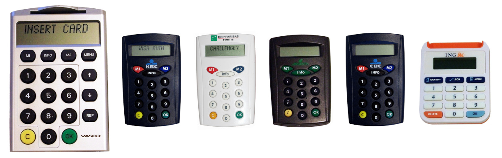

# About

This tool emulates an EMV-CAP device, to illustrate the article ["Banque en ligne : à la decouverte d'EMV-CAP"](http://connect.ed-diamond.com/MISC/MISC-056/Banques-en-ligne-a-la-decouverte-d-EMV-CAP) published in MISC, issue #56 and freely available online.

Examples of EMV-CAP calculators:



# Usage

Command line help:

```
$ ./EMV-CAP -h
usage: EMV-CAP [-h] [-l] [-L] [--tlv PARSETLV]
               [-r {<index>, <reader_substring>}] [-d] [-v] [-m {1,2}]
               [--warmreset {auto,yes,no}]
               [N [N ...]]

EMV-CAP calculator

optional arguments:
  -h, --help            show this help message and exit

Standalone options:
  -l, --listreaders     print list of available readers and exit
  -L, --listapps        print list of available applications on the card and
                        exit
  --tlv PARSETLV        parse a hex string into TLV elements

Global options:
  -r {<index>, <reader_substring>}, --reader {<index>, <reader_substring>}
                        select one specific reader with reader index, name
                        string or sub-string otherwise first reader found will
                        be used.
  -d, --debug           print exchanged APDU for debugging
  -v, --verbose         print APDU parsing

Modes and data:
  -m {1,2}, --mode {1,2}
                        M1/M2 mode selection (mandatory, unless -l or -L is
                        used)
  N                     number(s) as M1/M2 data: max one 8-digit number for M1
                        and max 10 10-digit numbers for M2
  --warmreset {auto,yes,no}
                        Warm reset: yes / no / auto (default) If 'auto' it
                        will perform a warm reset if the ATR starts with 3F
                        (indirect convention)

Examples:
    EMV-CAP --listreaders
    EMV-CAP --listapps
    EMV-CAP --listapps --debug --reader foo
    EMV-CAP -m1 123456
    EMV-CAP -m2
    EMV-CAP -m2 1000 3101234567
```

# Mac OSX support

EMV-CAP also works on Mac OSX (tested with Yosemite 10.10.5), you will need to install few dependencies though (you need to have pip and brew installed as prerequesite):

* brew: see the Brew homepage on how to install it
* pip: ```$ sudo easy_install pip```
* swig: ```$ brew install swig```
* pycrypto and pyscard: ```$ sudo pip install pycrypto pyscard ```

# Copyright and licensing terms

Each contribution is under the copyright of its author, as tracked by the Git history since 2011.
See the output of `git shortlog -nse` for a full list.

Initial authors:
-   Philippe Teuwen
-   Jean-Pierre Szikora

The source code is covered by the following licensing terms, usually referred as **GPLv3 or later**.

    This program is free software: you can redistribute it and/or modify
    it under the terms of the GNU General Public License as published by
    the Free Software Foundation, either version 3 of the License, or
    (at your option) any later version.

    This program is distributed in the hope that it will be useful,
    but WITHOUT ANY WARRANTY; without even the implied warranty of
    MERCHANTABILITY or FITNESS FOR A PARTICULAR PURPOSE.  See the
    GNU General Public License for more details.

A copy of the GPLv3 is available in [LICENSE](LICENSE.txt).

# Disclaimer

**Using this software for real financial operations can lead to some risks.**
Indeed advantage of using a standalone reader is is to isolate your banking card from big bad malwares.
**Using it in a non-secured reader is taking risk that a keylogger intercepts your PIN, a malware accesses to your card informations, or even intercepts your transaction to modify it or operates its own transactions.**

# Limitation of Liability

IN NO EVENT UNLESS REQUIRED BY APPLICABLE LAW OR AGREED TO IN WRITING
WILL ANY COPYRIGHT HOLDER, OR ANY OTHER PARTY WHO CONVEYS THE PROGRAM,
BE LIABLE TO YOU FOR DAMAGES, INCLUDING ANY GENERAL, SPECIAL,
INCIDENTAL OR CONSEQUENTIAL DAMAGES ARISING OUT OF THE USE OR INABILITY
TO USE THE PROGRAM (INCLUDING BUT NOT LIMITED TO LOSS OF DATA OR DATA
BEING RENDERED INACCURATE OR LOSSES SUSTAINED BY YOU OR THIRD PARTIES
OR A FAILURE OF THE PROGRAM TO OPERATE WITH ANY OTHER PROGRAMS), EVEN
IF SUCH HOLDER OR OTHER PARTY HAS BEEN ADVISED OF THE POSSIBILITY OF
SUCH DAMAGES.

# Links

* http://connect.ed-diamond.com/MISC/MISC-056/Banques-en-ligne-a-la-decouverte-d-EMV-CAP
* https://sites.uclouvain.be/EMV-CAP/
* Alternative: https://github.com/russss/python-emv
